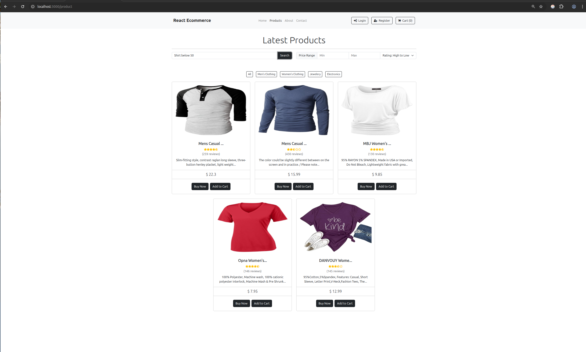

# E-commerce AI Product Search

A full-stack e-commerce demo with AI-powered natural language search.
Users can browse a static product catalog and search using conversational queries powered by OpenAI.

-----

## Features

  * 🛍 **Product Catalog Viewer**
    Displays a list of 9 sample products with name, price, category, description, and image.

  * ⭐ **Visual Ratings**
    Products now display a star rating to help users quickly assess product quality.

  * 💰 **Price Filter & Sorting**
    Users can filter products by a specific price range and sort the catalog by price or rating.

  * 🔍 **AI-Powered Smart Search (OpenAI)**
    Search with natural language, e.g.:

    > "Show me men's shirts under $50"
    > "Find gold rings above $100"

  * 📂 **Category Filters**
    Filter products by category (Men's Clothing, Women's Clothing, Jewelry, Electronics).

  * ⚡ **Full-stack Integration**
    React frontend with Express backend API, connected to OpenAI for semantic search.

-----

## Tech Stack

  * **Frontend:** React, Axios
  * **Backend:** Node.js, Express, CORS
  * **AI API:** OpenAI GPT
  * **Styling:** Basic CSS / Bootstrap

-----

## Run Locally

Clone the project:

```bash
git clone https://github.com/DeusNexus/ecommerce-ai-product-search.git
```

Go to the project directory:

```bash
cd ecommerce-ai-product-search
```

Install dependencies:

```bash
npm install react-material-ui-carousel --save --legacy-peer-deps
```

Create a `.env` file in the project root and add contents of `.env.bkp` and set the OPENAI key:

```
OPENAI_API_KEY=your_openai_api_key
```

Start the app (both client & server concurrently):

```bash
npm start
```

-----

## Access the App

Frontend:
[http://localhost:3000](https://www.google.com/search?q=http://localhost:3000)

Backend API:
[http://localhost:4001/api/ai-search](https://www.google.com/search?q=http://localhost:4001/api/ai-search)

-----

## Bonus: Blockchain Integration Idea

The AI-powered search could integrate with blockchain features such as:

  * **Token-gated Pricing** — Only users holding specific NFTs or tokens see special pricing.
  * **On-chain User Preferences** — Store user shopping preferences securely on-chain to personalize recommendations.
  * **Loyalty Smart Contracts** — Reward purchases with blockchain-based loyalty points that can be redeemed across multiple stores.

-----

## Example AI Search Queries

Try these example queries in the search box to see AI-powered results:

  - "Show me men's shirts under $50"
  - "Find gold rings above $100"
  - "SSD with more than 2TB"

-----

## Screenshots

The product catalog with star ratings, AI-powered search bar and filter options for price & rating.


Example usage of finding products that match AI-powered prompt search query using OpenAI API.



-----

## License

MIT License

-----


